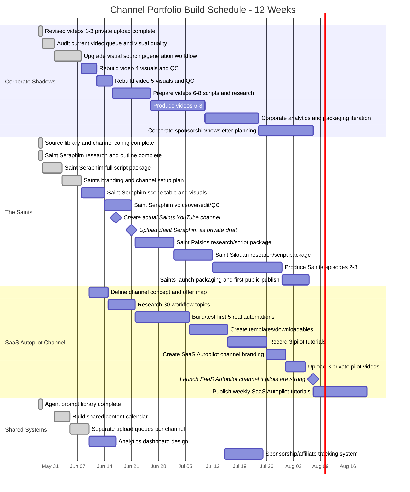

# Channel Portfolio Gantt Schedule

Schedule start: 2026-05-28
Planning horizon: 12 weeks

## Strategy

Run three lanes, but do not give all three equal production load immediately.

1. Corporate Shadows remains the active/live channel.
2. The Saints becomes the second active build lane.
3. SaaS Autopilot Automation starts with research and tested workflow prototypes, then becomes production-ready after the first two lanes have stable systems.

## Mermaid Gantt

## Week-by-Week Execution Plan

### Week 1: 2026-05-28 to 2026-06-03
- Corporate Shadows: audit videos 4-5 and visual quality blockers.
- Saints: write full Saint Seraphim script package.
- Systems: create shared content calendar and separate per-channel production tracking.

### Week 2: 2026-06-04 to 2026-06-10
- Corporate Shadows: upgrade visual sourcing/generation workflow.
- Saints: create channel branding plan and Seraphim production table.
- SaaS Autopilot: define concept, audience, offer map, and first workflow categories.

### Week 3: 2026-06-11 to 2026-06-17
- Corporate Shadows: rebuild video 4 and 5 visuals.
- Saints: generate Seraphim visuals and voiceover prep.
- Saints channel: create actual YouTube channel/Brand Account target if credentials are ready.
- SaaS Autopilot: research 30 topics.

### Week 4: 2026-06-18 to 2026-06-24
- Corporate Shadows: prepare scripts/research for videos 6-8.
- Saints: edit and QC Saint Seraphim, upload as private draft.
- SaaS Autopilot: build/test first real automations.

### Week 5: 2026-06-25 to 2026-07-01
- Corporate Shadows: produce video 6.
- Saints: Saint Paisios research and script package.
- SaaS Autopilot: continue testing automations.

### Week 6: 2026-07-02 to 2026-07-08
- Corporate Shadows: produce video 7.
- Saints: Saint Silouan research and script package.
- SaaS Autopilot: create templates/downloadables.

### Week 7: 2026-07-09 to 2026-07-15
- Corporate Shadows: produce video 8 and review analytics.
- Saints: produce episode 2.
- SaaS Autopilot: finish templates and choose first 3 pilot tutorials.

### Week 8: 2026-07-16 to 2026-07-22
- Corporate Shadows: packaging iteration from analytics.
- Saints: produce episode 3.
- SaaS Autopilot: record/edit 3 pilot tutorials.

### Week 9: 2026-07-23 to 2026-07-29
- Corporate Shadows: sponsorship/newsletter planning.
- Saints: launch packaging, thumbnails, channel page, descriptions.
- SaaS Autopilot: create branding and channel setup assets.

### Week 10: 2026-07-30 to 2026-08-05
- Saints: first public launch window if Seraphim is ready.
- SaaS Autopilot: upload private pilots and review quality.
- Corporate Shadows: continue steady production/analytics.

### Week 11: 2026-08-06 to 2026-08-12
- SaaS Autopilot: launch if pilots are strong.
- Saints: publish or schedule second episode.
- Corporate Shadows: continue queue.

### Week 12: 2026-08-13 to 2026-08-20
- Review all three lanes.
- Decide which lane gets more production capacity based on early signals.
- Begin monetization assets: newsletters, affiliate pages, templates, memberships.

## Start Dates by Channel

| Channel | Current Status | Active Production Start | First Private Draft Target | First Public Launch Target | Release Policy |
|---|---|---:|---:|---:|---|
| Corporate Shadows | Active/live | Already active | Already uploaded revised drafts | Continue after visual upgrades | Tuesday/Friday Cadence (Midnight MT) |
| The Saints | Build started | 2026-05-29 | 2026-06-21 | Immediate once cleared by QA | No schedule. Publish publicly immediately once cleared. |
| SaaS Autopilot Automation | Planned | 2026-06-10 | 2026-07-31 to 2026-08-05 | Immediate once cleared by QA | No schedule. Publish publicly immediately once cleared. |

## Key Dependencies

### Corporate Shadows
- Better visual workflow before more public publishing.
- Thumbnail permission/verification issue still needs YouTube Studio fix.

### The Saints
- Actual separate YouTube channel/Brand Account must be created.
- OAuth/channel routing must be separated from Corporate Shadows.
- First video should be uploaded private before public launch.

### SaaS Autopilot Automation
- Must be based on tested workflows, not generic AI news.
- Needs templates/downloadables before launch so monetization is not only AdSense.

## Decision Checkpoints

### 2026-06-21
Check whether Saint Seraphim private draft is ready and whether the separate saints channel exists.

### 2026-07-15
Check Corporate Shadows visual workflow and whether videos 6-8 can be produced reliably.

### 2026-08-05
Review SaaS Autopilot pilot videos. Launch only if tutorials are useful, tested, and template-backed.

### 2026-08-20
Portfolio review: allocate more production capacity to whichever lane shows the best combination of quality, monetization path, and audience response.

